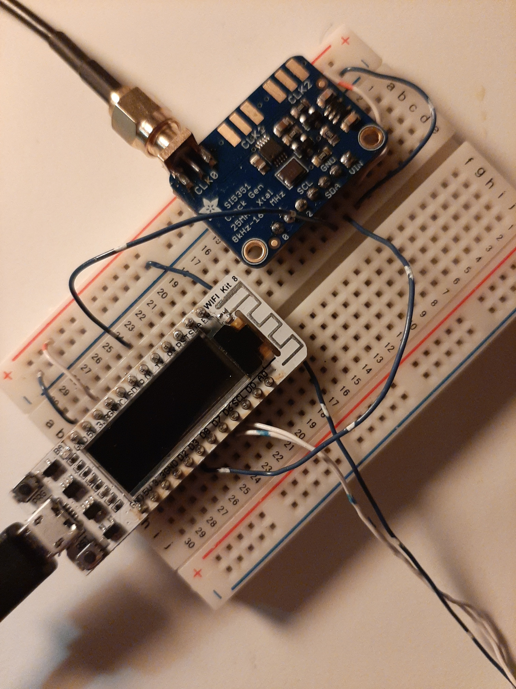

# SI5351 Micropython library

This repo contains another of my adaptations of the Adafruit SI5351 library
at https://github.com/adafruit/Adafruit_Si5351_Library.
This time it is for Micropython.

### Simple Example

Import the library into your Micropython code to gain access to the 
SI5351 over I2C.

The below example sets the SI5351 clock output 0 to 13.703704 MHz.

```python
from machine import Pin, I2C
import si5351

PIN_SCL = 5
PIN_SDA = 4

i2c = I2C(-1, Pin(PIN_SCL), Pin(PIN_SDA))

si = si5351.SI5351_I2C(i2c)

# vco = 25 MHz * (24 + 2 / 3) = 616.67 MHz
si.setupPLL(si.PLL_A, 24, 2, 3)

# out = 616.67 MHz / 45 = 13.703704 MHz 
si.setupMultisynth(0, si.PLL_A, 45)

# uncomment to divide 13.703704 by 64
# si.setupRdiv(0, si.R_DIV_64)

si.enableOutputs(True)
```

### The set_freq() method

I also added a method called set_freq.  This function
calculates and sets the multisynth and R dividers
based on the current VCO frequency of the PLL in use.
It only works for frequencies below about 100Mhz.

Here is an example:

```python
...
# vco = 25 MHz * 32 = 800 MHz
si.setupPLL(si.PLL_A, 32)

# set clk 0 to 7 Mhz based on the above vco
si.set_freq(clk, si.PLL_A, 7000000)

si.enableOutputs(True)
```

### VFO Example

The next example is an implementation of a VFO using the SI5351.
It was designed for the Heltec ESP8266 WIFIKIT Version A
and it is provided in the repo as example.py.

To use the VFO, attach a rotary knob to GPIO pins 12 and 13 of the WIFIKIT.
Next connect GPIO pins 4 and 5 for SDA and SCL to the same I2C pins
on the SI5351.  When the code first starts clk 0 will output 7Mhz.
Turning the knob will change the clk 0 frequency in 10 Hz steps.


```python

from machine import Pin, I2C
import time
import si5351

def latch2(p0, p1):
    a, b = p0.value(), p1.value()
    while True:
        a_last, b_last = a, b
        time.sleep_us(10)
        a, b = p0.value(), p1.value()
        if a == a_last and b == b_last: return a, b


class Knob:
    """
      ---     ---     ---            ---     ---     ---
     |   |   |   |   |   |     A    |   |   |   |   |   |  
    -     ---     ---     -        -     ---     ---     --
    ---     ---     ---                ---     ---     ---
       |   |   |   |   |       B      |   |   |   |   |   | 
        ---     ---     ---        ---     ---    ---  
          Turn Left                       Turn right
          A 1 1 0 0 1                     A 1 1 0 0 1
          B 1 0 0 1 1                     B 0 1 1 0 0
    """

    def __init__(self, pina, pinb):
        self.value = 0
        self.pina = pina
        self.pinb = pinb
        self.last_a = latch2(self.pina, self.pinb)[0]
        self.pina.irq(trigger=Pin.IRQ_RISING | Pin.IRQ_FALLING,
                      handler=self.callback)

    def callback(self, *args):
        a, b = latch2(self.pina, self.pinb)
        if a == 1 and self.last_a == 0:
            self.value += 1 if a == b else -1
            print('{:d}'.format(self.value))
            si.set_freq(0, si.PLL_A, center + knob.value * 10)
        self.last_a = a

# gpio pins

PIN_SCL = 5
PIN_SDA = 4

PIN_A = 13
PIN_B = 12
PIN_C = 14

# setup devices

center = 7000000
mult = 32
clk = 0

i2c = I2C(-1, Pin(PIN_SCL), Pin(PIN_SDA))

si = si5351.SI5351_I2C(i2c)
si.setupPLL(si.PLL_A, mult)
si.set_freq(clk, si.PLL_A, center)
si.enableOutputs(True)

knob = Knob(Pin(PIN_A, Pin.IN, Pin.PULL_UP), 
            Pin(PIN_B, Pin.IN, Pin.PULL_UP))

while True:
   pass

```


#### Implementation




